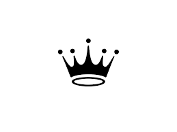

<p align="center">
<a href="https://www.meraki-academy.org" target="_blank" rel="noopener noreferrer">
 
 </a>
</p>

<h3 align="center">Crown Stores App
</h3>

---

<p align="center"> A simple and very easy to use  application with an amazing features that make it worth a visit, here you will find the best clothes from the biggest brands all over the world
    <br> 
<a href='http://localhost:3000/'>Crown Stores</a>
    <br> 
</p>

## 📝 Table of Contents

- [About](#about)
- [Getting Started](#getting_started)
- [Usage](#usage)
- [Built Using](#built_using)
- [User Story](#user_story)
- [Data Flow](#data_flow)
- [Guided By](#guided_by)

## 🧐 About <a name = "about"></a>

If you're intrested in fashion and fancy clothes, this is the perfect place for you, you will find high quality clothes with an affordable prices.

What makes this app special is that it's very easy to use, with tons of features that will make you find your needs in just a few seconds.

In case you're intimidated to shop from our stores, that's not a problem at all, you can simply read our customers comments about our products, and trust me you won't have any second thoughts left.

With that being said, what are you waiting for? visit our website and start your journey with us.


## 🏁 Getting Started <a name = "getting_started"></a>

These instructions will get you a copy of the project up and running on your local machine for development and testing purposes.

### Prerequisites

- Visual Studio Code follow this <a href='https://code.visualstudio.com/download'>link</a> to install.
- Git Bash follow this <a href='https://git-scm.com/downloads'>link</a> to install.
- MongoDB follow this <a href='https://www.mongodb.com/docs/manual/installation/'>link</a> to install.
- Node.js follow this <a href='https://nodejs.org/en/download/'>link</a> to install.

### Installing:

1. Clone the repo to your local machine using git bash.

```
git clone https://github.com/c6-HamzaYousif/MERAKI_Academy_Project_4.git
```

2. Install packeges repeat this step in backend and frontend folder

```
npm i
```

3. Run server using git bash inside backend folder

```
npm run dev
```

4. Run application using git bash inside frontend folder

```
npm start
```

Now app ready to use

## 🎈 Usage <a name="usage"></a>

- Here is our login page, you simply enter your email and password and join our website, if you don't have an account, click on sign in, and it will take you to our registration page.


#

- This is our registration page, you just fill the information, and your account is done already,

- Make sure to enter your email and password and your first name, these fields are required and you have to fill them to sign in.


#
- This is our home page, you can find various collection of clothes for different ages and styles.

- You can also shop by category by clicking on one of the following (Men, Women, Kids) which you can find in the top left of the page.

- Also you can search for the products you're looking for using the search bar in the top.

- You can also add items to your shopping cart by clicking the 'Add To Cart' button below the product.


#

- In order to get extra information about a product, all you have to do, is click on the product itself, and all the information below will be shown, in addition to a our customer's comments about our products.

- Also you can share your thoughts and opinions about our products by adding a comment, just click the button and share with us.


#

- If you click on the cart at the top of the website, it will take you to your shopping cart

- You can change the quantity of the products in the cart by clicking on the arrows that surrounds the quantity number.

- Also you can remove the item from your shopping cart by clicking on the 'x'.

- And if you want to buy any of the products, you can click on the 'purchase' button.


#

- If you click on your profile picture, you will get a drop down list:

- The first one is your order's history, where you can find every item you ever purchased from our website.


#

- The second one is for editing your profile, you can change any information you need, just click on the pen, and enter the new value, and click the 'Save Changes' button in the button of the page.


#

- The third one is for logging out from our website.

#

- Finally is our footer, you can find it if you scroll all the way down to the bottom of the website, you will find our social media platforms, where we post some of our collections there, so make sure to follow.

- Also, you will find a box for the comments and suggestions, please feel free to share your thoughts with us, and make sure that everything you write there will be taken to our considration.


## ⛏️ Built Using <a name = "built_using"></a>

- [MongoDB](https://www.mongodb.com/) - Database
- [Express JS](https://expressjs.com/) - Server Framework
- [React JS](https://https://reactjs.org/) - Web Framework
- [Node JS](https://nodejs.org/en/) - Server Environment

## User Story <a name = "#user_story"></a>

Your trello board link
<a href='https://trello.com/b/6B8vMove/project-4'>Trello</a>

## Data Flow <a name = "#data_flow"></a>

</a>

## ⚠️ Guided By <a name = "guided_by"></a>

This project is guided by ©️ **[MERAKI Academy](https://www.meraki-academy.org)**